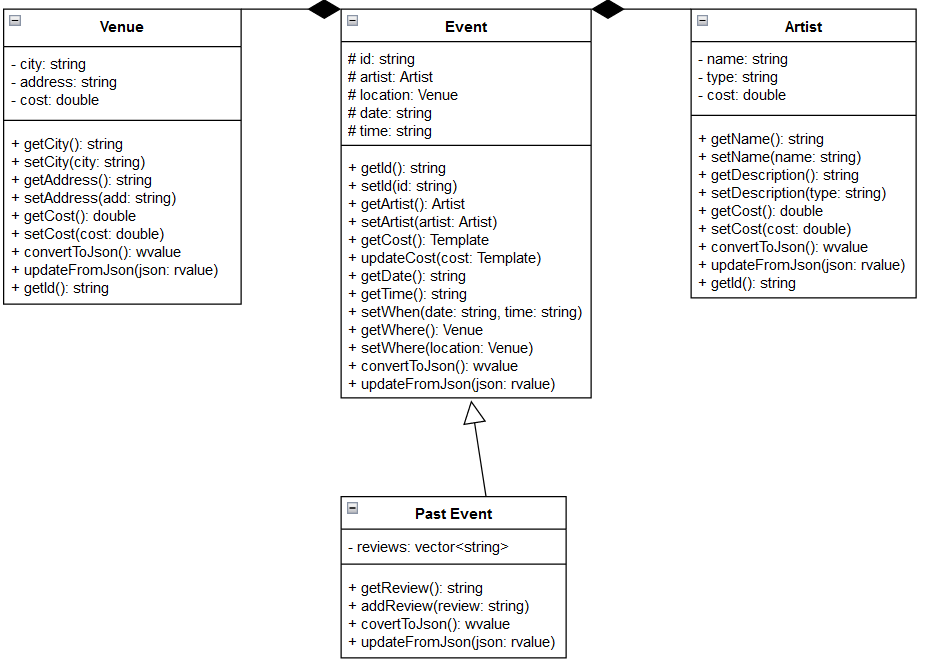

# Project Design Document

## Introduction

This API will allow for an easy line of communication between a touring artist and their fanbase about details of the shows on an upcoming/partially completed tour.

## Background/Context

When an performing artist decides to go on a tour, it can be hard to keep track of show dates/locations/times.  This is especially the case if they are a smaller group dealing with smaller venues, which are often liable to change/cancel.  New and longtime fans alike are often left scrambling at the last minute, scouring all of (if any) of bands and venues social media looking for last-minute changes.  This API should hopefully solve this problem by offering a line a communication from the artist to the fans, letting the artist add/delete/update shows as their information changes, and letting fans immediately see those changes.  Ideally, the fans can then sort/search through theses shows by their date/location, and if a recording of a finished show exists, the fan can listen to/watch it.

## Stakeholders

 - **Artists**: people who need events, will be able to schedule, organize tours, social gatherings and events. They are interested in attendance tracking, and overall event planning.

 - **Fans**: they are interested in tracking the cities where the events of their favourite artists will be held. They rely on API to get the newest information about their artists and their tours and events.

## Functional Requirements

1. **Resource Creation**
   - The service shall allow artists to create new resource entries for events and locations via POST requests.
   - The service shall validate all incoming data against predefined schemas before creating a new resource.
   - The service shall return a `201 Created` status code and the created resource in the response body upon successful creation.

2. **Resource Retrieval**
   - The service shall provide endpoints for customers and artists to retrieve lists of past events, events by location, and incoming events of artists via GET requests.
   - The service shall allow retrieval of detailed information for a single resource by its unique identifier.
   - The service shall return a `200 OK` status code and the requested resources in the response body upon successful retrieval.

3. **Resource Update**
   - The service shall permit artists to update existing resource entries for artists' incoming events via PUT requests, and then location's events to be updated accordingly.
   - The service shall validate all incoming data for updates against predefined schemas.
   - The service shall return a `200 OK` status code and the updated resource in the response body upon successful update.

4. **Resource Deletion**
   - The service shall enable artists to delete resource entries for incoming events and location's events accordingly via DELETE requests.
   - The service shall return a `204 No Content` status code upon successful deletion.
   - The service shall return a `403 Forbidden` status code if an unauthorized user attempts to delete a resource.

5. **Data Validation**
   - The service shall enforce data validation rules to ensure that all resource data conforms to the expected formats, types, and constraints.
   - The service shall return a `400 Bad Request` status code along with error details if validation fails.

6. **Authentication and Authorization**
   - The service shall require authentication for users attempting to create, update, or delete resources.
   - The service shall authorize users based on their roles, permitting only authorized artists to modify or delete resource entries.

7. **Error Handling**
   - The service shall implement comprehensive error handling to provide meaningful error messages and appropriate HTTP status codes to the client for all failed operations.
   - The service shall return a `404 Not Found` status code when a requested resource cannot be located.
   - The service shall return a `500 Internal Server Error` status code in the event of unexpected server-side errors.

## Use Case Description

### Events
- **Create (POST)**
   - As an artist, I want to be able to add a new event that I am going to hold at some city.

- **Read (GET)**
   - As a customer or as an artist, I would like to know which events are going to be held in the next 6 months using this platform.

- **Update (PUT)**
   - As an artist, I want to update future event's date if time conflict appears.

- **Delete (DELETE)**
   - As an artist, I want to delete my future event if it gets cancelled.
### Past Events
- **Create (POST)**
   - As a customer, I want to leave a comment/review about past event
- **Read (GET)**
   - As a customer or as an artist, I want to get information about past events
- **Update (PUT)**
   - As an artist, I want to update previous event's description
- **Delete (DELETE)**
   - As an artist, I want to delete information about previous events

### Artist
- **Create (POST)**
   - As an artist, I want to create a new profile of verified artist type
- **Read (GET)**
   - As an artist, I want to read comments on my previous events left by costumers

   - As a customer, I want to read artist's profile description
- **Update (PUT)**
   - As an artist, I want to update my profile description
- **Delete (DELETE)**
   - As an artist, I want to delete my profile

### Venue
- **Create (POST)**
   - As an artist, I want to add a new city where the event will be held, if no event was hosted before in that city
- **Read (GET)**
   - As a customer or as an artist, I want to see all events by location

## List Of Resources

- **Past events**: events that occured 6 months before the current date
- **Events**: events that will occur and are planned in the next 6 months
- **Artist**: artist who will hold the event
- **Venue**: city and its events that were in the past and the future

## List of End Points
In the context of this API, {id} would typically be replaced by a unique identifier for the resource, such as a string or a number that uniquely identifies an Event/Past Event.  {artist} would be replaced by an artist's name, and {venue} would be replaced by a city.

### Events/Past Events
- **POST** `/api/events`
   - **Description**: Create a new Event.
   - **Request BODY**: `{"id": "1", "artist": "BNL", "venue": "Toronto ON", "cost": 10, "date": "5/11/2024", "time": "6:00 PM"}`
   - **Response**: `201 Created` with the created Event object in the body.
   - **Error**: `400 Bad Request` if input validation fails; `403 Forbidden` if the user is unauthorzied.

- **GET** `/api/events`
   - **Description**: Retrieves a list of all Events, past or future.
   - **Response**: `200 OK` with an array of Event objects in the body.

- **GET** `/api/events/{id}`
   - **Description**: Retrieves the details of the specific Event.
   - **Response**: `200 OK` with the Event object in the body.
   - **Error**: `404 Not Found` if the Event does not exist.

- **GET** `/api/events?upcoming`
   - **Desciption**: Retrieves a list of all upcoming Events
   - **Response**: `200 OK` with an array of Event objects in the body.

- **GET** `/api/events?past`
   - **Desciption**: Retrieves a list of all past Events
   - **Response**: `200 OK` with an array of Event objects in the body.

- **GET** `/api/events?location={venue}`
   - **Desciption**: Retrieves a list of all Events in a specific city.
   - **Response**: `200 OK` with an array of Event objects in the body.

- **GET** `/api/events?artist={artist}`
   - **Desciption**: Retrieves a list of all Events by a specific artist.
   - **Response**: `200 OK` with an array of Event objects in the body.

- **GET** `/api/events?sort={date}`
   - **Desciption**: Retrieves a list of all Events in order of when they occur.
   - **Response**: `200 OK` with an array of Event objects in the body.

- **GET** `/api/events/{id}?review`
   - **Description**: Gives a random review from the Past Event.
   - **Response**: `200 OK` with the random review in the body.
   - **Error**: `400 Bad Request` if the event is not a Past Event; `404 Not Found` if the Event does not exist;

- **GET** `/api/events/{id}?recording`
   - **Description**: Plays a recording of a past event if it exists.
   - **Response**: `200 OK` while playing the recording if found, the message, none found if not recorded.
   - **Error**: `400 Bad Request` if the event is not a Past Event; `404 Not Found` if the Event does not exist;

- **PUT** `/api/events/{id}`
   - **Desciption**:  Updates an existing Event.
   - **Request BODY**: `{"id": "1", "artist": "BNL", "venue": "Toronto ON", "cost": 10, "date": "5/11/2024", "time": "6:00 PM"}`
   - **Response**: `200 OK` with the updated Event object in the body.
   - **Error**: `400 Bad Request` if input validation fails; `404 Not Found` if the Event does not exist; `403 Forbidden` if the user is unauthorzied.

- **PUT** `/api/events/{id}?finished`
   - **Desciption**:  Turns a normal event into a Past Event/Updates a Past Event.
   - **Request BODY**: `{"id": "1", "artist": "BNL", "venue": "Toronto ON", "cost": 10, "date": "5/11/2024", "time": "6:00 PM", "wasRecorded": true, "recording": "TorontoShow.mp3", "attendence": 1000, "reviews":["it was cool"]}`
   - **Response**: `200 OK` with the updated Event object in the body.
   - **Error**: `400 Bad Request` if input validation fails; `404 Not Found` if the Event does not exist; `403 Forbidden` if the user is unauthorzied.

- **PUT** `/api/events/{id}?review`
   - **Description**: Adds a review to the Past Event
   - **Request BODY**: `"it was cool"`
   - **Response**: `200 OK` with the new review in the body.
   - **Error**: `400 Bad Request` if the event is not a past event; `404 Not Found` if the Event does not exist;

- **DELETE** `/api/events/{id}`
   - **Description**: Deletes a specific event
   - **Response**: `204 No Content`.
   - **Error**: `404 Not Found` if the Event does not exist; `403 Forbidden` if the user is unauthorzied.

### Artist
- **POST** `/api/artists`
   - **Description**: Create a new Artist.
   - **Request BODY**: `{"name": "BNL", "type": "Canadian Alt-Rock Band", "members": ["Ed Robertson", "Tyler Stewart"]}`
   - **Response**: `201 Created` with the created Artist object in the body.
   - **Error**: `400 Bad Request` if input validation fails; `403 Forbidden` if the user is unauthorzied.

- **GET** `/api/artists`
   - **Description**: Retrieves a list of all Artists.
   - **Response**: `200 OK` with an array of Artist objects in the body.

- **GET** `/api/artists/{artist}`
   - **Description**: Retrieves the details of the specific Artist.
   - **Response**: `200 OK` with the Artist object in the body.
   - **Error**: `404 Not Found` if the Artist does not exist.

- **PUT** `/api/artists/{artist}`
   - **Desciption**:  Updates an existing Artist.
   - **Request BODY**: `{"name": "BNL", "type": "Canadian Alt-Rock Band", "members": ["Ed Robertson", "Tyler Stewart"]}`
   - **Response**: `200 OK` with the updated Artist object in the body.
   - **Error**: `400 Bad Request` if input validation fails; `404 Not Found` if the Event does not exist; `403 Forbidden` if the user is unauthorzied.

- **DELETE** `/api/artists/{artist}`
   - **Description**: Deletes a specific Artist
   - **Response**: `204 No Content`.
   - **Error**: `404 Not Found` if the Artist does not exist; `403 Forbidden` if the user is unauthorzied.

### Venue
- **POST** `/api/venues`
   - **Description**: Create a new Venue.
   - **Request BODY**: `{"city": "Toronto ON", "address": "290 Bremner Blvd", "cost": 10, "space": 300}`
   - **Response**: `201 Created` with the created Venue object in the body.
   - **Error**: `400 Bad Request` if input validation fails; `403 Forbidden` if the user is unauthorzied.

- **GET** `/api/venues`
   - **Description**: Retrieves a list of all venues.
   - **Response**: `200 OK` with an array of Venue objects in the body.

- **GET** `/api/venues/{venue}`
   - **Description**: Retrieves the details of the specific Venue.
   - **Response**: `200 OK` with the Venue object in the body.
   - **Error**: `404 Not Found` if the Venue does not exist.

- **PUT** `/api/venues/{venue}`
   - **Desciption**:  Updates an existing Venue.
   - **Request BODY**: `{"city": "Toronto ON", "address": "290 Bremner Blvd", "cost": 10, "space": 300}`
   - **Response**: `200 OK` with the updated Venue object in the body.
   - **Error**: `400 Bad Request` if input validation fails; `404 Not Found` if the Venue does not exist; `403 Forbidden` if the user is unauthorzied.

- **DELETE** `/api/venue/{venues}`
   - **Description**: Deletes a specific Venue
   - **Response**: `204 No Content`.
   - **Error**: `404 Not Found` if the Venue does not exist; `403 Forbidden` if the user is unauthorzied.

### Error Handling Strategies
- **Validation Errors**: Respond with `400 Bad Request` and include the error details.
- **Authentication/Authorization Errors**: Utilize `401 Unauthorized` for authentication issues and `403 Forbidden` for authorization issues.
- **Not Found Errors**: Use `404 Not Found` when a resource cannot be located.
- **Server Errors**: Respond with `500 Internal Server Error` for unexpected server-side issues.

This API will also use standard HTTP status codes to communicate the outcome of API requests, ensuring that clients can handle responses appropriately.

## UML Diagrams

